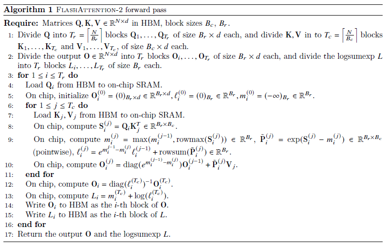

# 简易的flash attention V2 CUDA实现
## 前言
### 小补丁
这里只是学习过程中记录一下自己想到的最简单的算法实现，为了简化，将不考虑batch。也不考虑各种优化问题。同时假设矩阵形状优美从而无需考虑越界问题。
### 为什么要有flash attention？
transformer架构的自注意力计算将$Q,K,V$做如下计算
$$
S = \frac{Q \times K^T}{\sqrt d} \\
P = softmax(S) \\
O = P \times V
$$
其中$d$是一个固定的常数，因为在训练时需要做反向传播，所以$Q,K,V$求导对中间产生的$S,P$有依赖，这要求将这些矩阵存储起来。<br>
假设输入的长度为$N$, 那么$Q,K,V$都是大小为$N \times d$的Tensor，很容易可以得知，$S,P$的大小将是$N \times N$这意味着随着序列长度的增加，对存储的要求随着平方增长，显存大小将成为瓶颈。<br>
另一方面，读取在显存中的$S,P$将拖累计算的速度。<br>
为了解决显存不够用，以及显存读取慢的问题，flash attention被设计了出来。它通过将矩阵分块进行计算，并且在反向传播时重新计算$S,P$的策略避免了将中间量$S,P$存储在显存中，节约了显存，并用计算代替了读取，从而提高了GPU的使用效率。

### flash attention V2是如何做到的？
原论文的算法<br>
<br>
分块计算的过程可以参考<https://zhuanlan.zhihu.com/p/1969739436033040416><br>
通过<br>
- 在外层循环里将矩阵$Q$分块，每次外循环处理$Q$的一个分块$Q_i$，并计算出输出$O_i$，以及用于反向传播快速计算$P$的$m = rowmax(S)$和$l = rowsum(S)$<br>
  - 在内循环将$K,V$分块，每次内循环处理一个$K_j,V_j$分块<br>
  - 完成整个内循环将处理完Q_i和$KV$的乘法并且累加得到$O_i$以及$S$每一行的最大值m和每一行的和l
- 完成整个外循环将完成自注意力的所有前向传播计算 
    

## CUDA代码实现和解读
一些实现上的思路参考了<https://zhuanlan.zhihu.com/p/1977200373526700439><br>
代码在<https://github.com/ytm789654/cuda_learning/blob/main/flashattention.cu><br>

### 拆解问题
这是我觉得CUDA最难的一步，要仔细分析每个block和每个thread的工作内容，这样才能把代码组织出来。
- 每个block要做什么<br>
  外层循环里，每一轮循环都不会产生彼此依赖，所以可以每个BLOCK处理一个Q的分块，BLOCK并行增加算法外层的循环步进。那么每个BLOCK需要做的事情就是读取$Q_i$，执行内层循环，完成$O_i$的计算并且把结果写回显存。<br>
  即
  - 读取$Q_i$数据， 大小 $B_c \times d$
  - 启动内层循环
    - 读取$K_j, V_j$， 大小 $B_c \times d$
    - 计算$S_j,P_j$， 大小 $B_c \times B_c$
    - 计算$m_j和l_j$，大小 $B_c$
    - 计算$P_j \times V_j$并更新$O_i$
  - 将$O_i / l, m + \ln{l}$写回显存
  - 处理下一个$QTile$
- 每个thread要做什么<br>
  给每个block分配$B_c$个thread，从而Q_i执行矩阵乘法时可以让每个线程单独负责每行的计算。结合BLOCK的工作内容，每个thread应该
  - 与其他thread合作读取$Q_i$
  - 进入内层循环
    - 与其他thread合作读取$K_j, V_j$
    - 负责$S_j,P_j$中具体某一行的计算
    - 负责$S$中，的rowmax 和rowsum计算
    - 负责$P_j \times V_j$中具体某一行的计算，并更新$O_i$的对应行
  - 将$O_i / l, m + \ln{l}$写回显存，具体到负责的行

### 代码实现分析

#### 外层循环和框架
```C++
__global__ void flash_attention_kernel(const float *Q, const float *K, const float *V,
                                       const int N, const int d, const float scale,
                                       const int Bc, const int Tr, // for simple, assume Bc = Br = BLOCK_SIZE and Tr = Tc, and N = Bc * x
                                       float *O, float *L)
{
    extern __shared__ float sram[];
    const int tile_size = Bc * d;
    float *Q_i = sram;
    float *K_j = &sram[tile_size];  //Bc x d, same to K_j, V_j, O_i
    float *V_j = &sram[tile_size * 2];
    float *O_i = &sram[tile_size * 3];
    float *S = &sram[tile_size * 4]; //Bc x Bc
    for (int tile_id = blockIdx.x; tile_id < Tr; tile_id += gridDim.x)
    {
        // LOOP CONTENT ...
        for (int row_bias = 0; row_bias < Bc; row_bias++)
        {
            int col = threadIdx.x;
            while(col < d){
                Q_i[row_bias * d + col] = Q[(tile_id * Bc + row_bias) * d + col];
                O_i[row_bias * d + col] = 0.0f;
                col += Bc;
            }
        }
        float m_j = -FLT_MAX;
        float prev_m_j = -FLT_MAX;
        float l_j = 0.0f;
        float prev_l_j = 0.0f;

        for (int j = 0; j < Tr; j++)
        {
            // inner loop....
        }
        // write O_i to O, write m + log(l) to L
        // due to O rely on l_j and l_j stored in each thread, so each thread handle one row in O_i
        for (int col = 0; col < d; col++)
            O[(tile_id * Bc + threadIdx.x) * d + col] = O_i[threadIdx.x * d + col] / l_j;
        L[tile_id * Bc + threadIdx.x] = m_j + __logf(l_j);
    }
}
```
上边代码是函数头部和共享内存的定义以及外层循环框架部分。

使用共享内存我认为是有如下的原因
-   一方面原论文里明确写明了这些分块是on chip
-   另一方面
    -   矩阵$Q_i$其实并不需要在线程之间共享，但是可以在读取的时候，控制warp依次读入$Q_i$的每一行从而实现合并访存。<br>
    -   $K_j, V_j$在BLOCK内可以共享，一次读取多次使用。因为每个线程控制的行都需要与$K_j,V_j$做矩阵乘法
    -   $O_i$需要在循环中多次更新，多次写回显存会因为IO影响计算。
    -   $S,Q_i,O_i$ 尤其是$S$ (大小为$B_c \times B_c$)存放在线程寄存器里，可能会突破线程寄存器上限，同时也容易让SM上不能同时驻留多个BLOCK

这里的实现很简单的假定了$d$不会很大，$B_c = 32$，理论上这些值也不会特别大<br>
对于$Q_i$的读取，控制不同线程读取同一行不同的列，并写入到对应的位置，从而实现合并访存，同时能避免bank conflict。初始化$O_i$思路类似<br>
但是在写回$O$时，由于依赖thread中的变量l_j，所以必须控制每个线程写O的一行。这会导致访存利用率低下且会出现bank conflict，一个我能想到的可行的解决方案是用共享内存存下$l_j$，并像读取$Q_i$类似的方式访问$O$<br>

同时 每次处理新的$Q$ tile将对$m$和$l$做对应的初始化

#### 内层循环部分
1. 读取$K,V$
```C++
    for (int row_bias = 0; row_bias < Bc; row_bias++)
    {
        int col = threadIdx.x;
        while(col < d){
            K_j[row_bias * d + col] = K[(j * Bc + row_bias) * d + col];
            V_j[row_bias * d + col] = V[(j * Bc + row_bias) * d + col];
            col += Bc;
        }
    }
    __syncthreads();
```
没啥好说的，套路类似，但是要注意BLOCK内做一次同步，因为之后要交叉使用其他thread读取的数据，所以要同步保证数据准备好了。<br>

2. 计算$S$
```C++
    for (int K_jr = 0; K_jr < Bc; K_jr++)
    {
        float qk = 0.0f;
        for (int col = 0; col < d; col++)
            qk += Q_i[threadIdx.x * d + col] * K_j[K_jr * d + col];
        qk = qk * scale;
        m_j = m_j > qk ? m_j : qk;
        S[threadIdx.x * Bc + K_jr] = qk;
    }
```
这里是直接手动进行的点乘累加操作，没有用任何库（其实是目前还不会用）。理论上常规程序计算$S$需要三重循环:定位S[x][y]需要两重循环，点乘计算S[x][y]的值需要一重循环。但是因为CUDA通过threadIdx.x定位第一个坐标，且刚好假设Bc = BLOCK_SIZE，所以刚好这里不需要循环。可以想想看如果Bc是BLOCK_SIZE的倍数要如何处理。其实我觉得简单点让Bc = BLOCK_SIZE蛮好的。。。<br>

因为计算是$Q \times K^T$ 所以直接让$Q$和$K$对应的行去按行做点乘就行，同时及时更新好m_j的值。上次看到为了避免warp divergence，应该用三目运算符取代掉if后的赋值操作。<br>

一个需要注意的点是计算的结果是写回S[threadIdx.x][K_jr]，因为K_jr虽然是按行访问$K$但是实际上对应的是$K^T$的列号。之前多次提到过，用threadIdx.x控制$Q$的行号，同时$S$每行有$B_c$个元素，而不是d个。<br>

1. 计算$P$和$l_j$
```C++
    l_j = 0.0f;
    for (int col = 0; col < Bc; col++)
    {
        float p = __expf(S[threadIdx.x * Bc + col] - m_j);
        l_j += p;
        S[threadIdx.x * Bc + col] = p;
    }
```
注意$S$的stride是$B_c$就行。另外把P的结果写回到S里是为了省点内存。

1. 计算$P \times V$更新$O_i$
```C++
    //calc PV and accumulate into O_i
    for (int col = 0; col < d; col++)   //for each col in V
    {
        float pv = 0.0f;
        for (int V_jr = 0; V_jr < Bc; V_jr++)
            pv += S[threadIdx.x * Bc + V_jr] * V_j[V_jr * d + col];
        O_i[threadIdx.x * d + col] = O_i[threadIdx.x * d + col] * __expf(prev_m_j - m_j) + pv;
    }
```
$P \times V$计算的结果大小为$B_c \times d$，所以仍然用threadIdx.x 定位结果的行号且省略掉一重循环。因为是用线程控制$P$的一行按列去与$V$做点乘，所以外层循环是$V$的列，内层循环是$V$的行。同时缩放O_i，把结果累加进去。<br>
另外可以注意到，$K,V$并没有被同时使用到，所以可以像$S,P$的复用一样复用$K,V$的内存。

1. 更新$l, m$
```C++
    //update l, m
    l_j += prev_l_j * __expf(prev_m_j - m_j);   //in fact init l_j in exp(m_j - prev_m_j) is the same, but this step follow algo
    prev_m_j = m_j;
    prev_l_j = l_j;
    //end inner loop
```
没啥好说的